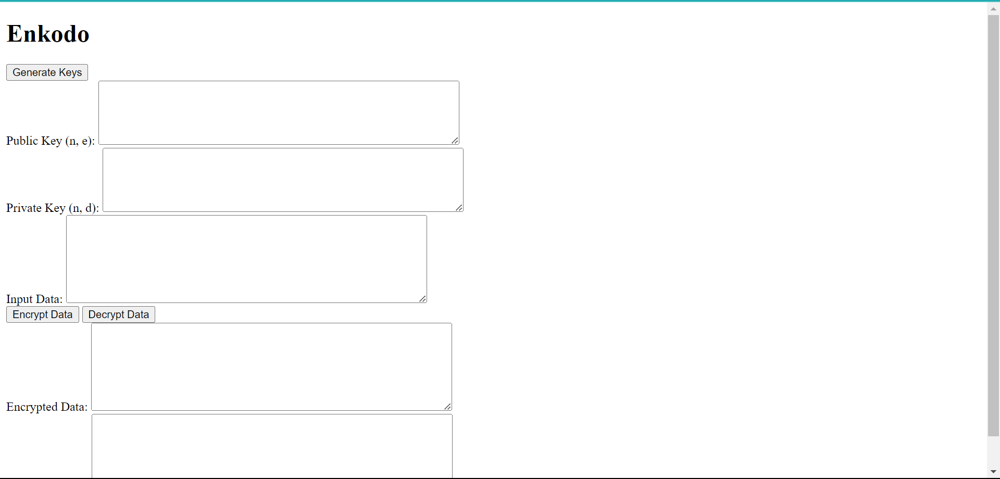
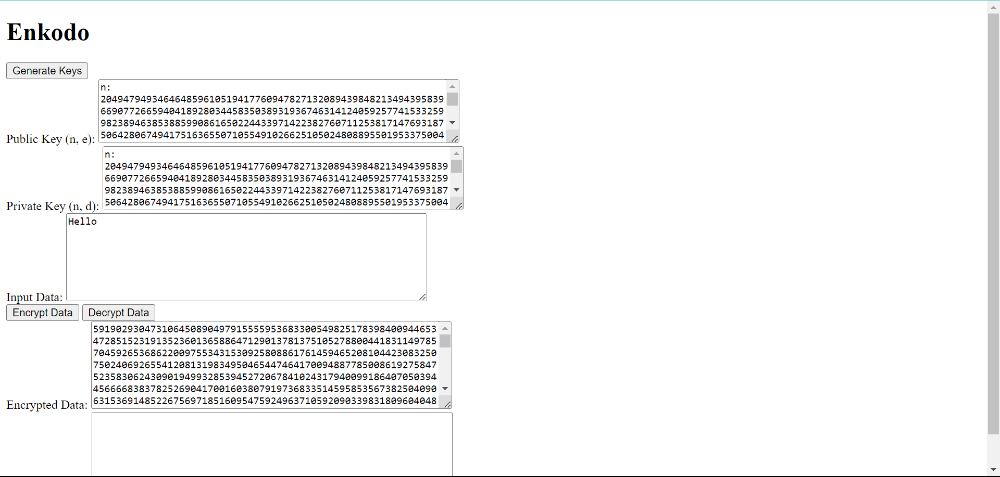
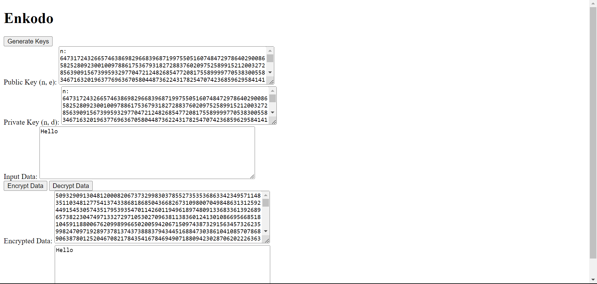

Sau khi tải về hay chạy file `index.html` sẽ hiển thị 1 giao diện như này

Nhập bất kỳ nội dung gì vào ô `Input Data` sau đó nhấn nút `Encrypt Data` máy tính sẽ hiển thị mã hóa ở Ô `Encrypted Data`. như này

Bấm tiếp vào nút `Decrypt` đợi chương trình thực hiện và xuất hiện nội dung ở ô `Decrypted Data` như hình
 

 Kiểm tra xem nội dung ở ô `Decrypted Data` có giống `Encrypt Data` hay không? Nếu có sự khác nhau xin hãy phản hồi