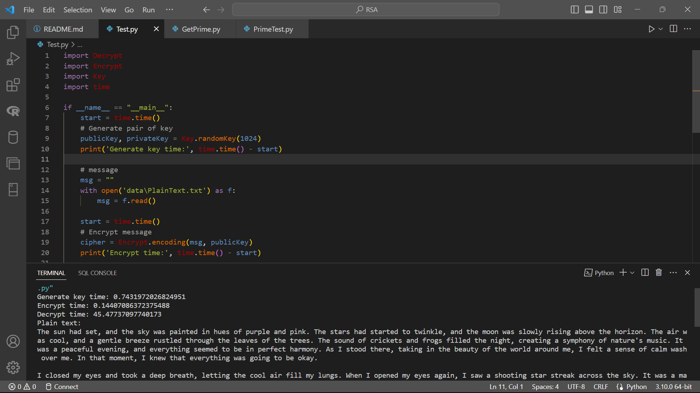

# MÃ HÓA RSA

Chương trình tiến hành mã hóa đoạn tiếng anh bằng sử dụng RSA. Người dùng sẽ truyền vào tham số 2 số nguyên tố hoặc 2 số nguyên và chương trình sẽ tìm ra số nguyên tố gần nhất với số đó hoặc cũng có thể truyền vào 1 khoảng và chương trình tìm ngẫu nhiên 2 số nguyên tố trong khoảng để tạo khóa `public key` và `private key`.

Sau khi có cặp khóa người sử dụng sẽ dung `public key` để mã hóa thành các chuỗi số. Người nhận thông điệp sẽ dụng `private key` để giải mã. Nếu khi nhập vào văn bản tiếng việt thì khi giải mã sẽ bị lỗi biên dịch.

## How It Work
- ***Decrypt.py***: Chứa các hàm để giải mã
    * decypt(cipherText, privateKey): Trả về đoạn văn bản đã được giải mã

- ***Encrypt.py***: Chứa các hàm để mã hóa
    * encoding(message, publicKey): Mã hóa `message` bằng `publicKey`

- ***GetPrime.py***: Chứa các phương thức để sinh ra số nguyên tố ngẫu nhiên có độ dài `bits`
    * randomNumber (bits): Trả về số ngẫu nhiên có độ dài `bits`
    * isPrime(number): Kiểm tra xem số `number` có phải số nguyên tố không?
    * getNumer(bits): Tạo 1 số nguyên tố ngẫu nhiên có độ dài `bits`
    * nextPrime(number): Trả về số nguyên tố lớn hơn gần nhất với `number`
    
- ***Key.py*** : Chứa các hàm để tạo khóa
    * gcd(a, b): Trả về UCLN của 2 số `a` và `b`
    * generateKey(p, q): Trả về cặp `key`
    * randomKey(bits): Trả về cặp `key` với tham số `p` và `q` lấy ngẫu nhiên với độ dài `bits`.

- ***PrimeTest.py***: Chứa các phương thức kiểm tra xem một số có thể là số nguyên tố không
    *  PRIMES: list[int] - Danh sách một số số nguyên tố nhỏ
    *  preprocessor(number): Kiểm tra xem số nguyên `number` có phải số nguyên tố không bằng cách kiểm tra xem số `number` có phải bội của các 
    *  fermat(number, times): Kiểm tra xem số nguyên `number` có phải số nguyên tố không bằng sử dụng thuật toán Fermat với số lần lặp là `times`
    *  check(prime, number, n, s): Hỗ trợ phương thức `millerRobin` kiểm tra xem số `number` có phải số nguyên tố hay không
    *  millerRobin(number, time): kiểm tra xem số `number` có phải số nguyên tố hay không sử dụng thuật toán Miller - Robin

- ***Test.py***: Test chương trình


## Release History

* 0.2.3 - 10 August 2023:
    Hoàn thiện demo web với tính năng duy nhất là tạo key tự động

* 0.2.2 - 09 August 2023:

    Xóa các phương thức `GetPrime.savePrime`, `Key.saveKey`, `Key.getKey`, `Encrypt.saveData`, `Encrypt.toText`, `Encrypt.crypt`
    Đổi lại tên các phương thức `PrimeTest.Preprocessor` thành `PrimeTest.preprocessor`, `Decrypt.decypt` thành `Decrypt.decrypt`
    Thêm demo phiên bản web
    Thêm flow chart tại `img\FlowChart.png`


* 0.2.1 - 05 May 2023:

    Thêm kiểm tra và lấy số nguyên tố gần nhất với p và q khi p và q được truyền vào không phải số nguyên tố

* 0.2.0 - 05 May 2023:

    Thay đổi cách kiểm tra số nguyên tố
    
    Tách tạo số nguyên tố và kiểm tra số nguyên tố sang 1 file khác
    
    Xóa bỏ chương trình tìm Private Key khi biết Public Key

* 0.1.2 - 18 Apirl 2023:

    Sửa đổi cách tạo `key` ngẫu nhiên
    
    Thay đổi hàm crypt từ in ra các chuỗi số thành in ra các chuỗi gồm các ký tự
    
    Ghi kết quả của `crypt` sang file `data\out.txt`
    
    Thêm phương thức `toText` để chuyển số thành đoạn `text` đặc biệt
    
* 0.1.1 - 12 Apirl 2023:

    Sửa đổi `saveData` trong `Encrypt.py`
    
    Sửa đổi `Test.py` - Thêm lưu dữ liệu vào file `ciphertext.txt`
    
* 0.1.0 - 12 Apirl 2023:

    Phát hành và sử dụng được
* 0.0.1 - 04 Apirl 2023

    Đang trong quá trình phát triển

## Author

Hoàng Tuấn Tú – [Facebook| Hoàng Tú](https://www.facebook.com/tuantu2610/) – hoangtuantu893@gmail.com

## Running the tests

Nhập vào 2 số p và q, nếu là số nguyên tố sẽ là nhanh nhất, nếu không phải số nguyên tố thì chương trình sẽ tìm ra số nguyên tố lớn hơn gần nhất với số truyền vào. Truyền đoạn văn bản vào trong file `data\PlainText.txt` sau đó chạy file `Test.py` để mã hóa. Đoạn văn bản được mã hóa sẽ được chuyển thành các số và được lưu trong file `data\ciphertext.txt`

### Sample Tests

ở trong test này:
```
p = 133365637624242586918822851403653634640620654799419223379043582833544248436567028975731385362443589198243595240691580232100430124098249821031239758799294184009921715906706638633024743149616568492877518464422411218652102130776860520735535136264246184101340256914011100970808161844534343046647779188742592638719
q = 120562766858326550164222008573849601284998295071491737099375871140381729729534205690919453526991554492784464480380399284710350982389262461422499623980393429637422776159863292111303506657674185293126360612776985616313152633447119634174978867391364495675068709128495802973214827171177514168976037765110891247561
```

`p` và `q` là 2 số nguyên tố đủ lớn để làm cho việc bẻ khóa trở nên khó khăn hơn. Văn bản mã hóa toàn bộ là tiếng anh và được lưu trữ trong file `data\PlainText.txt`


