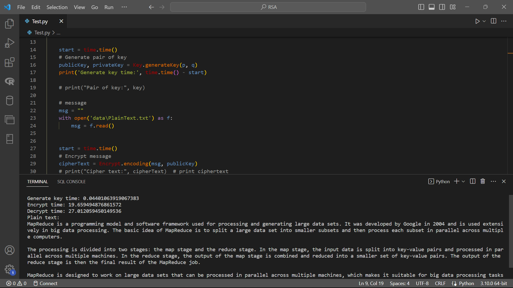

# MÃ HÓA RSA

Chương trình tiến hành mã hóa đoạn tiếng anh bằng sử dụng RSA. Người dùng sẽ truyền vào tham số 2 số nguyên tố hoặc 2 số nguyên và chương trình sẽ tìm ra số nguyên tố gần nhất với số đó hoặc cũng có thể truyền vào 1 khoảng và chương trình tìm ngẫu nhiên 2 số nguyên tố trong khoảng để tạo khóa `public key` và `private key`.

Sau khi có cặp khóa người sử dụng sẽ dung `public key` để mã hóa thành các chuỗi số. Người nhận thông điệp sẽ dụng `private key` để giải mã. Nếu khi nhập vào văn bản tiếng việt thì khi giải mã sẽ bị lỗi biên dịch.

## How It Work
- ***Decrypt.py***: Chứa các hàm để giải mã
    * decypt(cipherText, privateKey): Trả về đoạn văn bản đã được giải mã
- ***Encrypt.py***: Chứa các hàm để mã hóa
    * encoding(message, publicKey): Mã hóa `message` bằng `publicKey`
    * toText(number): Chuyển số thành một văn bản
    * crypt(text): Chuyển danh sách chứa các số nguyên thành danh sách chứa đoạn `text` đặc biệt
    * saveData(text): Lưu dữ liệu vào file có đường dẫn `data\ciphertext.txt`
- ***FindingKey.py***: Chứa các hàm để tìm `private key`
    * primeFactor(number): Trả về mảng chứa các ước số nguyên tố của `number`
    * findPrivateKey(publicKey): Tìm và trả về `private key` dựa trên `public key` được chuyền vào
- ***Key.py*** : Chứa các hàm để tạo khóa
    * gcd(a, b): Trả về UCLN của 2 số `a` và `b`
    * isPrime(number): Kiểm tra xem `number` số có phải số nguyên tố không
    * nextPrime(number): Trả về số nguyên số lớn hơn gần nhất `number`
    * randomNumber (bits): Trả về số ngẫu nhiên có độ dài `bits`
    * generateKey(p, q): Trả về cặp `key`
    * randomKey(bits): Trả về cặp `key` với tham số `p` và `q` lấy ngẫu nhiên với độ dài `bits`.
    * saveKey(publicKey, privateKey): Lưu các `key` vào trong file `data\key.json`
    * getKey(path): Trả về cặp `key` được lấy ra từ file có đường dẫn `path`
- ***Test.py***: Test chương trình


## Release History
* 0.1.2 - 18 Apỉl 2023
    Sửa đổi cách tạo `key` ngẫu nhiên
    Thay đổi hàm crypt từ in ra các chuỗi số thành in ra các chuỗi gồm các ký tự
    Ghi kết quả của `crypt` sang file `data\out.txt`
    Thêm phương thức `toText` để chuyển số thành đoạn `text` đặc biệt
    
* 0.1.1 - 12 Apirl 2023
    Sửa đổi `saveData` trong `Encrypt.py`
    Sửa đổi `Test.py` - Thêm lưu dữ liệu vào file `ciphertext.txt`
* 0.1.0 - 12 Apirl 2023
    * Phát hành và sử dụng được
* 0.0.1 - 04 Apirl 2023
    * Đang trong quá trình phát triển

## Author

Hoàng Tuấn Tú – [Facebook| Hoàng Tú](https://www.facebook.com/tuantu2610/) – hoangtuantu893@gmail.com

## Running the tests

Nhập vào 2 số p và q, nếu là số nguyên tố sẽ là nhanh nhất, nếu không phải số nguyên tố thì chương trình sẽ tìm ra số nguyên tố lớn hơn gần nhất với số truyền vào. Truyền đoạn văn bản vào trong file `data\PlainText.txt` sau đó chạy file `Test.py` để mã hóa. Đoạn văn bản được mã hóa sẽ được chuyển thành các số và được lưu trong file `data\ciphertext.txt`

### Sample Tests

ở trong test này:
```
p = 163799160197134459132100397031692924582140521143395065308165662909921731475492881461885714198763447790540722189270461047716065749053243729458406978243702676245271139995501580688628076737625444142578429466339861368858551501197567226430703695824931148294023468989931292056209256389858704308853423367966743482191
q = 149303830103537302718331149637557961636628297749789399546261072665768777045020575638219088388062299505276053863200809202577104436887509450785219783246599794655893290094438596385699374460820733662284252500585022896903027767819107178048857396922447758961077716916382851972496676264274467387771873501935840755741
```

`p` và `q` là 2 số nguyên tố đủ lớn để làm cho việc bẻ khóa trở nên khó khăn hơn. Văn bản mã hóa toàn bộ là tiếng anh và được lưu trữ trong file `data\PlainText.txt`

